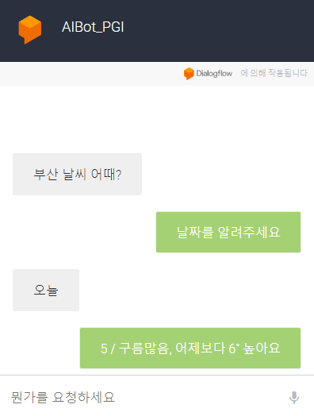
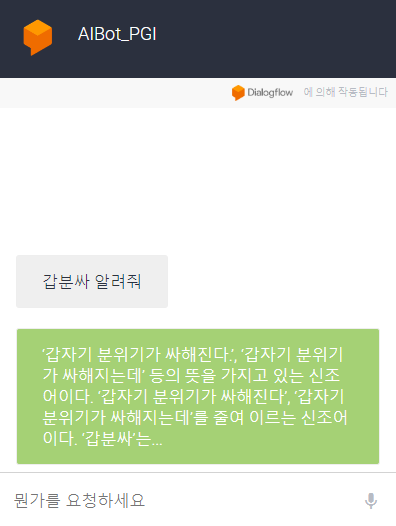
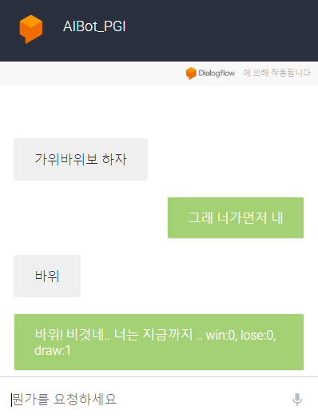

# server.py

```python
from flask import Flask, request
from bs4 import BeautifulSoup
import urllib
import json
import random


app = Flask(__name__)
app.config['JSON_AS_ASCII'] = False
users = {}

@app.route('/dialogflow', methods=['POST', 'GET'])
def home():
    if request.method == 'GET':
        file = request.args.get("file")
        with open(file, encoding='UTF8') as json_file:
            req = json.load(json_file)
    else:
        req = request.get_json(force=True)
        print(json.dumps(req, indent=4, ensure_ascii=False))
        # with open('jsonData/data.json', 'w', encoding='utf-8') as make_file:
        #     json.dump(req, make_file, indent=4, ensure_ascii=False)

    return processingAnswer(req)

def processingAnswer(req):
    paramsUse = getParamsUse(req)
    answer = paramsUse['ans']

    if paramsUse['allRequiredParamsPresent']:
        if paramsUse['ittName'] == 'query':
            answer = answerQuery(paramsUse['params']['any'])
        if paramsUse['ittName'] == 'weather':
            answer = answerWeather(paramsUse['params']['geo-city'])
        if paramsUse['ittName'] == 'RockPaperScissors_Coice':
            answer = answerRockPaperScissors_Coice(paramsUse['session'],
                                                   paramsUse['params']['any'])

    return {'fulfillmentText': answer}


def getParamsUse(res):
    return {'params': res['queryResult']['parameters'],
            'allRequiredParamsPresent': res['queryResult']['allRequiredParamsPresent'],
            'ans': res['queryResult']['fulfillmentText'],
            'ittName': res['queryResult']['intent']['displayName'],
            'session': res['session']}

def answerWeather(city):
    url = 'https://search.naver.com/search.naver?query='
    url = url + urllib.parse.quote_plus(city + '날씨')
    bs = BeautifulSoup(urllib.request.urlopen(url).read(), 'html.parser')
    temp = bs.select('span.todaytemp')[0].text
    desc = bs.select('p.cast_txt')[0].text

    return temp + ' / ' + desc


def answerRockPaperScissors_Coice(session, valueUserChoice):
    winCases = {'바위': '가위',
                '가위': '보',
                '보': '바위'}
    valueServerChoice = random.choice(list(winCases.keys()))
    if not users.get(session):
        users[session] = User()
    user = users[session]

    if winCases[valueServerChoice] == valueUserChoice:
        answer = f'{valueServerChoice}! 내가 이김;'
        user.lose += 1
    elif valueServerChoice == valueUserChoice:
        answer = f'{valueServerChoice}! 비겻네..'
        user.draw += 1
    else:
        answer = f'{valueServerChoice}! 내가 졌다..'
        user.win += 1

    return answer + '\n' + user.info()


class User:
    def __init__(self):
        self.win = 0
        self.lose = 0
        self.draw = 0

    def info(self):
        return f'너는 지금까지 .. win:{self.win}, lose:{self.lose}, draw:{self.draw}'

def answerQuery( word):
    url = 'https://search.naver.com/search.naver?where=kdic&query='
    url = url + urllib.parse.quote_plus(word)
    bs = BeautifulSoup(urllib.request.urlopen(url).read(), 'html.parser')
    outputs = bs.select('p.txt_box')

    return outputs[0].text

if __name__ == '__main__':
    app.run(host='0.0.0.0', port=3000, debug=True)
```


<br>

# 결과


<br>

## 지역 & 날씨 




<br>

## naver 지식백과




<br>

## 가위바위보

