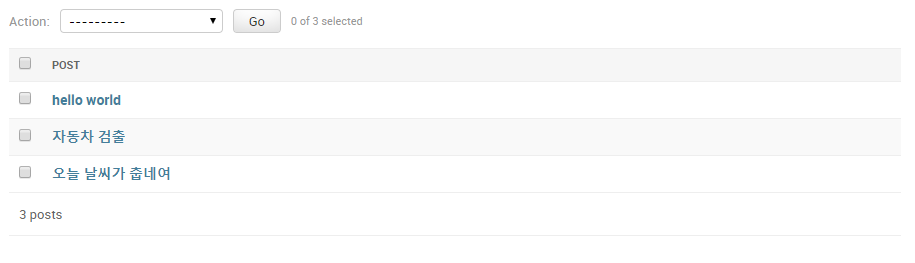
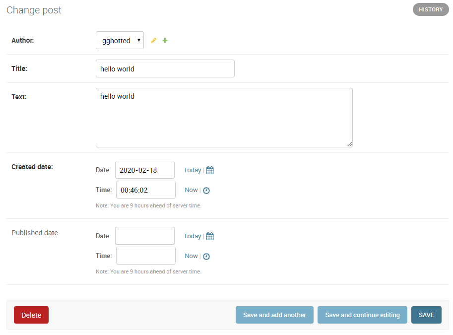

# 02-18


## blog예제 app 만들기

 ```
1. terminal -> mysite/ 에서
python manage.py startapp blog

2. settings.py -> INSTALLED_APPS 에서
'blog' 추가
 ```


```python
# 3. blog/models.py 에서
# 아래 내용추가

from django.db import models
from django.utils import timezone


class Post(models.Model):
    author = models.ForeignKey('auth.User', on_delete=models.CASCADE)
    title = models.CharField(max_length=200)
    text = models.TextField()
    created_date = models.DateTimeField(default=timezone.now)

    # blank=True: app 레벨에서 빈값 허용
    # null=True: db 레벨에서 빈값 허용
    published_date = models.DateTimeField(blank=True, null=True)

    def publish(self):
        self.published_date = timezone.now()
        self.save()

    def __str__(self):
        return self.title
```


```python
# blog/admin.py 에서
# 4. 아래 내용추가

from django.contrib import admin
from .models import Post

admin.site.register(Post)
```


```
# terminal -> mysite/ 에서
5. python manage.py makemigrations blog

# terminal -> mysite/ 에서
6. python manage.py migrate
```


7. browser -> admin 페이지에서

   test 글 작성

   

   

   




8. terminal -> mysite 에서

   python manage.py shell_plus --notebook

   

9. new -> Django Shell-Plus -> blog.ipynb 생성

   

10. blog.ipynb 내용작성