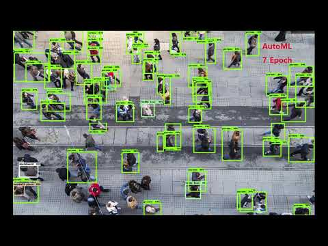
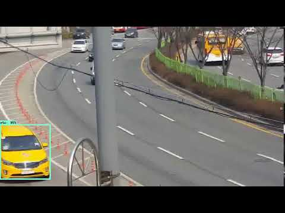
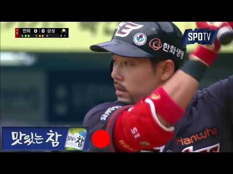

# 수아랩

* http://www.sualab.com/product/suakit
* 딥러닝, 불량검사

# 세븐미어캣

* [https://www.rocketpunch.com/jobs/67160/%EC%BB%B4%ED%93%A8%ED%84%B0-%EB%B9%84%EC%A0%84-%EB%94%A5%EB%9F%AC%EB%8B%9D-%EC%97%B0%EA%B5%AC%EC%9B%90](https://www.rocketpunch.com/jobs/67160/컴퓨터-비전-딥러닝-연구원)

* 주차장

>세븐미어캣은 주차장의 인공지능화를 꿈꾸는 AI 스타트업입니다. 15년 경력의 주차공사 실력을 바탕으로 관련 하드웨어를 직접 제조하고 있으며, 개발한 딥러닝 모델 On-Device화를 진행 중에 있습니다. LPR(번호 인식)기술 개발을 시작으로, 차량 데이터를 통한 컴퓨터 비전 AI 기술 개발을 목표로 하고 있습니다. 부족하더라도 열정을 가지고 회사와 성장하고자 하는 분을 모시려 합니다.

# 브릭

* https://www.rocketpunch.com/companies/brique/jobs
* 이상감지 with 센서데이터

# 리터너블

* http://returnable.co.kr/?page_id=26
* 영상합성, 스마트글라스

# 제이온가드

* https://www.rocketpunch.com/companies/jeiongadeu/jobs
* 영상-교통사고 예측 에어백

# 에이아이노미스

* https://www.rocketpunch.com/companies/ai-nomis/jobs

>##### 영유아의 표정 인식 및 상태 추론
>
>영유아의 얼굴 표정을 인식하여 현재 상태를 알려줍니다.
>
>
>
>아직 의사 전달이 힘든 영유아의 얼굴 표정을 카메라로 인식하여 현재 상태를 알려줍니다. 생리활동이나 배고픔 아픔등을 알아내는데 도움을 줍니다.
>또한 유아 돌연사 증후군을 방지합니다.

# 노타

* https://www.rocketpunch.com/companies/jusighoesa-nota/jobs
* 오타방지 소프트키보드

# AIRI

* http://airi.kr/category/research/

>영상의 내용을 설명하는 한국어 문장 생성 및 영상에 있는 유명인을 인식하여 문장에 반영
>
>한글 텍스트를 지정 화자에 목소리로 읽어주는 기능 및 화자 종속 음

# LAONBUD

* http://www.laonbud.com/

### OUR PORTFOLIO

[사람 인식 및 추적영상 내에서 사람을 인식하고 경로를 추적](https://youtu.be/Dm8K5wm_StE)

[AutoML for ClassificationAUTOML을 활용한 차종 분석](https://youtu.be/coDqrm-ZR3A)

[광고 인식영상 내 광고 인식 및 위치 분석](https://youtu.be/6gjbGGwVR2U)

[나이키 로고 검출영상 내 나이키 로고 인식 및 위치 분석](https://youtu.be/Jv8gnMQCEKU)

# INDJ

* http://indj.net/
* 음악추천

# BEANZ SOFT

* http://www.beanzsoft.co.kr/homepage/business/aitube
* 유명인 음성합성
* 얼굴합성

> 
>
> ## 인공지능을 통한 얼굴 인식으로 얼굴 변경
>
> <세계일보 “유튜브 영상에 내 얼굴이..” 보호 못 받는 SNS 초상권> 이같이 초상권 문제가 나타나고 있습니다.
> A.I tube 는 원하는 이미지로 얼굴변경을 통해서 초상권 문제를 해결합니다.

# 네오사피엔스

* https://typecast.ai/
* 유명인 음성합성