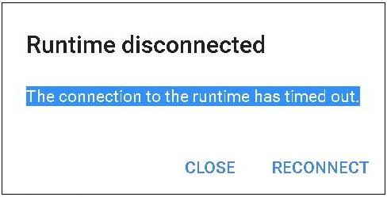

# colab session timeout될 때

<br>

**장기간 미사용시 session을 방지하는 매크로**

<br>



<br>

```javascript
# colab 실행 browser console에서 매크로 코드 실행

function ConnectButton(){
    console.log("Connect pushed"); 
    document.querySelector("#connect").click() 
}
setInterval(ConnectButton,60000);
```


