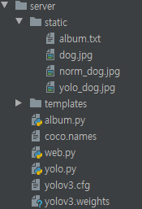

# yolo 갤러리 만들어보기

<br>

## 폴더구조



<br>

## web.py

```python
from flask import Flask, render_template, request
from album import Album, Image, load
import yolo

app = Flask(__name__)

ALBUM_PATH = './static/album.txt'
try:
    album = load(ALBUM_PATH)
except:
    album = Album()


@app.route('/')
def index():
    return render_template('home.html', title='홈 페이지')


@app.route('/list')
def list():
    return render_template('list.html', images=album.images)


@app.route('/view')
def view():
    img = album.finder[int(request.args.get('id'))]
    return render_template('view.html', img=img)


@app.route('/upload', methods=['POST'])
def upload():
    img = request.files['img']
    title = request.form.get('title')
    algorithm = request.form.get('algorithm')
    filename = algorithm + '_' + img.filename
    pathSaved = './static/' + filename

    img.save(pathSaved)
    if algorithm == 'yolo':
        yolo.detectObject(pathSaved)
    album.add(Image(title, filename))
    album.save(ALBUM_PATH)

    return alertNGo('업로드 완료', '/list')


@app.route('/delete')
def delete():
    album.delete(int(request.args.get('id')))
    album.save(ALBUM_PATH)
    return alertNGo('삭제 완료', '/list')


def alertNGo(msg, href):
    js = f'''
        <script>
            alert('{msg}');
            window.location.href = '{href}';
        </script>
    '''
    return js


if __name__ == '__main__':
    app.run(host='0.0.0.0', port=3000, debug=True)
```

<br>

## album.py

```python
import pickle


class Album():

    def __init__(self):
        self.autoId = 0
        self.finder = {}

    def add(self, image):
        image.id = self.autoId
        self.autoId += 1
        self.finder[image.id] = image

    def delete(self, img_id):
        del self.finder[img_id]

    def save(self, path):
        with open(path, 'wb') as f:
            pickle.dump(self, f)

    @property
    def images(self):
        return self.finder.values()


class Image():

    def __init__(self, title, file):
        self.id = None
        self.title = title
        self.file = file


def load(path):
    with open(path, 'rb') as f:
        obj = pickle.load(f)
    return obj
```

<br>

## yolo.py

```python
import cv2 as cv
import argparse
import numpy as np

confThreshold = 0.5  #Confidence threshold
nmsThreshold = 0.4   #Non-maximum suppression threshold
inpWidth = 416       #Width of network's input image
inpHeight = 416      #Height of network's input image

# Load names of classes
classesFile = "coco.names"
classes = None
with open(classesFile, 'rt') as f:
    classes = f.read().rstrip('\n').split('\n')
# Give the configuration and weight files for the model and load the network using them.
modelConfiguration = "yolov3.cfg"
modelWeights = "yolov3.weights"

net = cv.dnn.readNetFromDarknet(modelConfiguration, modelWeights)
net.setPreferableBackend(cv.dnn.DNN_BACKEND_OPENCV)
net.setPreferableTarget(cv.dnn.DNN_TARGET_CPU)


# Get the names of the output layers
def getOutputsNames(net):
    # Get the names of all the layers in the network
    layersNames = net.getLayerNames()
    # Get the names of the output layers, i.e. the layers with unconnected outputs
    return [layersNames[i[0] - 1] for i in net.getUnconnectedOutLayers()]

# Draw the predicted bounding box
def drawPred(frame, classId, conf, left, top, right, bottom):
    # Draw a bounding box.
    cv.rectangle(frame, (left, top), (right, bottom), (255, 178, 50), 3)
    
    label = '%.2f' % conf
        
    # Get the label for the class name and its confidence
    if classes:
        assert(classId < len(classes))
        label = '%s:%s' % (classes[classId], label)

    #Display the label at the top of the bounding box
    labelSize, baseLine = cv.getTextSize(label, cv.FONT_HERSHEY_SIMPLEX, 0.5, 1)
    top = max(top, labelSize[1])
    cv.rectangle(frame, (left, top - round(1.5*labelSize[1])), (left + round(1.5*labelSize[0]), top + baseLine), (255, 255, 255), cv.FILLED)
    cv.putText(frame, label, (left, top), cv.FONT_HERSHEY_SIMPLEX, 0.75, (0,0,0), 1)

# Remove the bounding boxes with low confidence using non-maxima suppression
def postprocess(frame, outs):
    frameHeight = frame.shape[0]
    frameWidth = frame.shape[1]

    # Scan through all the bounding boxes output from the network and keep only the
    # ones with high confidence scores. Assign the box's class label as the class with the highest score.
    classIds = []
    confidences = []
    boxes = []
    for out in outs:
        for detection in out:
            scores = detection[5:]
            classId = np.argmax(scores)
            confidence = scores[classId]
            if confidence > confThreshold:
                center_x = int(detection[0] * frameWidth)
                center_y = int(detection[1] * frameHeight)
                width = int(detection[2] * frameWidth)
                height = int(detection[3] * frameHeight)
                left = int(center_x - width / 2)
                top = int(center_y - height / 2)
                classIds.append(classId)
                confidences.append(float(confidence))
                boxes.append([left, top, width, height])

    # Perform non maximum suppression to eliminate redundant overlapping boxes with
    # lower confidences.
    indices = cv.dnn.NMSBoxes(boxes, confidences, confThreshold, nmsThreshold)
    for i in indices:
        i = i[0]
        box = boxes[i]
        left = box[0]
        top = box[1]
        width = box[2]
        height = box[3]
        drawPred(frame, classIds[i], confidences[i], left, top, left + width, top + height)  
        
        
def detectObject(filename) :
    frame = cv.imread(filename)
    blob = cv.dnn.blobFromImage(frame, 1/255, (inpWidth, inpHeight), [0,0,0], 1, crop=False)
    net.setInput(blob)
    outs = net.forward(getOutputsNames(net))
    postprocess(frame, outs)
    cv.imwrite(filename, frame)
    print(filename)
```

